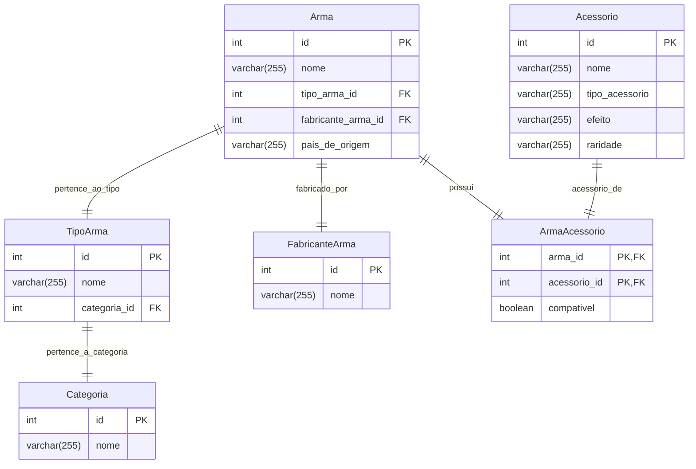

# Projeto Banco de Dados - Armas do Call of Duty

Este projeto implementa um banco de dados relacional para armazenar informações sobre armas do Call of Duty, incluindo seu nome, tipo e país de origem.

## Integrantes do Grupo

Gabriel Balbine - R.A.: 22.222.001-4

Guilherme Albuquerque - R.A.: 22.224.024-4

Nathan Vespasiano - R.A.: 22.124.086-4

## Descrição do Projeto

O objetivo deste projeto é criar um banco de dados para armazenar informações sobre armas do Call of Duty, permitindo consultas e análises sobre as diferentes armas disponíveis no jogo.  O banco de dados inclui informações como o nome da arma, o tipo de arma (fuzil de assalto, pistola, etc.) e o país de origem da arma.

## Modelo de Dados

O modelo de dados consiste em cinco entidades principais, representando informações sobre armas, seus tipos, fabricantes, acessórios e a compatibilidade entre armas e acessórios.  As entidades e seus atributos são descritos abaixo:

* **Categoria:**
    * `id` (INT, PK): Chave primária da tabela, identificador único da categoria.
    * `nome` (VARCHAR(255)): Nome da categoria da arma (ex: "Primária", "Secundária").

* **TipoArma:**
    * `id` (INT, PK): Chave primária da tabela, identificador único do tipo de arma.
    * `nome` (VARCHAR(255)): Nome do tipo de arma (ex: "Fuzil de Assalto", "Pistola").
    * `categoria_id` (INT, FK): Chave estrangeira referenciando a tabela `Categoria`, indicando a qual categoria o tipo de arma pertence.

* **FabricanteArma:**
    * `id` (INT, PK): Chave primária da tabela, identificador único do fabricante.
    * `nome` (VARCHAR(255)): Nome do fabricante da arma (ex: "Kalashnikov", "Colt").

* **Arma:**
    * `id` (INT, PK): Chave primária da tabela, identificador único da arma.
    * `nome` (VARCHAR(255)): Nome da arma (ex: "AK-47", "M1911").
    * `tipo_arma_id` (INT, FK): Chave estrangeira referenciando a tabela `TipoArma`, indicando o tipo da arma.
    * `fabricante_arma_id` (INT, FK): Chave estrangeira referenciando a tabela `FabricanteArma`, indicando o fabricante da arma.
    * `pais_de_origem` (VARCHAR(255)): País de origem da arma.

* **Acessório:**
    * `id` (INT, PK): Chave primária da tabela, identificador único do acessório.
    * `nome` (VARCHAR(255)): Nome do acessório (ex: "Mira Holográfica", "Silenciador").
    * `tipo_acessorio` (VARCHAR(255)): Tipo do acessório (ex: "Mira", "Cano", "Coronha").
    * `efeito` (VARCHAR(255)): Efeito do acessório na arma (ex: "+Precisão", "-Recuo").
    * `raridade` (VARCHAR(255)): Raridade do acessório (ex: "Comum", "Raro", "Lendário").


* **ArmaAcessorio:** (Tabela intermediária para o relacionamento N:M entre Arma e Acessório)
    * `arma_id` (INT, FK, PK): Chave estrangeira referenciando a tabela `Arma` e parte da chave primária composta.
    * `acessorio_id` (INT, FK, PK): Chave estrangeira referenciando a tabela `Acessorio` e parte da chave primária composta.
    * `compativel` (BOOLEAN): Indica se o acessório é compatível com a arma.


## Diagrama Relacional (Mermaid)



## Requisitos

MySQL 8.0+ (ou outro SGBD de sua escolha)

## Instalação e Execução

Crie o banco de dados: CREATE DATABASE cod_armas; (no MySQL Workbench ou terminal)

Execute o script SQL: Importe o arquivo criar_tabelas.sql para o seu banco de dados.

Insira os dados: Execute os comandos INSERT presentes no arquivo inserir_dados.sql.

## Exemplos de Consultas (SQL)

-- Listar todas as armas

```SQL
SELECT * FROM Arma;
```

-- Listar armas de um tipo específico (ex: Fuzil de Assalto)

```SQL
SELECT a.nome
FROM Arma a
JOIN TipoArma ta ON a.tipo_arma_id = ta.id
WHERE ta.nome = 'Fuzil de Assalto';
```

-- Listar armas de um país específico (ex: Estados Unidos)

```SQL
SELECT nome FROM Arma WHERE pais_de_origem = 'Estados Unidos';
````

## Observações

Este projeto é um exemplo simplificado e pode ser expandido com mais atributos e funcionalidades. Como por exemplo munições, dano, cadência, carregadores, etc.


## Contribuições

Contribuições são bem-vindas! Sinta-se à vontade para abrir issues e pull requests.
